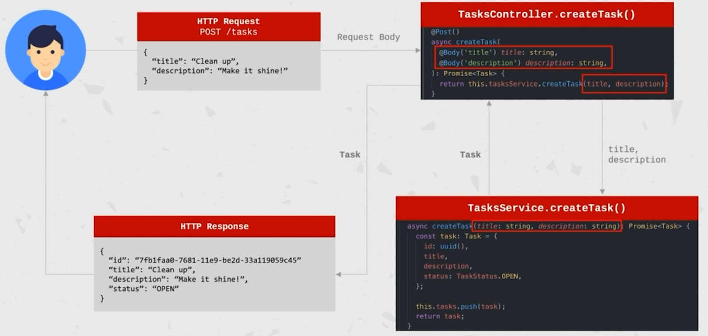
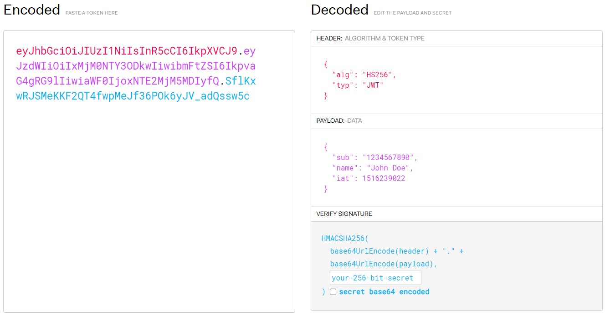

# Nest v7.4.0

A quick guide for NestJS | September 2020

## 0. CLI

1.  Installation:

```typescript
// npm
$ npm i -g @nestjs/cli
// or yarn (CMD Admin: $ choco install yarn)
$ yarn global add @nestjs/cli
```

2.  Create a project: `$ nest new task-management`

    

3.  Main commands by Nest CLI:

    ```typescript
    // Installation
    $ yarn install
    // Running the app: development
    $ yarn start
    // Running the app: watch mode
    $ yarn start:dev
    // Running the app: production mode
    $ yarn start:prod
    // Test: unit tests
    $ yarn test
    // Test: e2e tests
    $ yarn test:e2e
    // Test: test coverage
    $ yarn test:cov
    ```

4.  Modules:

    - They are an effective way to organize components by a closely related set of capabilities (e.g. per feature).
    - Modules are **singletons**, therefore a module can be imported by multiple other modules.
    - Each application has at least one module - the root module. That is the starting point of the application.
    - It is a good practice to have a folder per module, containing the module's components.
    - **@Module Decorator** provides metadata that Nest uses to organize the application structure, and its properties are:
      - _providers_: Array of providers to be available within the module via dependency injection;
      - _controllers_: Array of controllers to be instantiated within the module;
      - _exports_: Array of providers to export to other modules;
      - _imports_: List of modules required by this module. Any exported provider by these modules will now be available on our module via dependency injection.
    - Command to generate a module: `$ nest g module tasks`

5.  Controllers:

    - Responsible for handling incoming **requests** and returning **responses** to the client.
    - Bound to a specific **path** ('/tasks').
    - Contain **handlers**, which handle **endpoints** and **request methods** (@Get(), @Post(),...).
    - Can take advantage of **dependency injection** to consume providers within the same module.
    - Command to generate a controller: `$ nest g controller tasks --no-spec` (_--no-spec_ to not generate the spec file / unit test).

6.  Providers:

    - Can be injected into constructors if decorated as **@Injectable**, via **dependency injection**.
    - Can be a plain value, a class, sync/async factory,...
    - Must be provided to a module for the to be usable.
    - Can be exported from a module, and then be available to other modules that import it.
    - **Services** are defined as providers BUT **Not all providers are services**. They are singletons when wrapped with **@Injectable()** and provided to a module. That means, the same instance will be shared across the application, acting as a single source of truth.
    - Command to generate a provider/service: `$ nest g service tasks --no-spec`

7.  Features:

    - Getting all tasks: `http://localhost:3000/tasks`
    - Use the uuid package to generate the id:
      - https://www.npmjs.com/package/uuid
      - `$ yarn add uuid`
    - Two ways to use the @Body decorator in a POST:
      - `(@Body() body)`
      - ```typescript
        (
           @Body('title') title: string,
           @Body('description') description: string
        )
        ```

8.  DTOs:

    - An example of an HTTP Request-Response where we don't have a unified way to define the data looks like. Imagine we have to change one field, remove or add a new one:
      
    - A **Data Transfer Object** is an object that carries data between processes that can be defined using an interface or class.
    - The recommended approach is to use classes since interfaces are a part of TypeScript and therefore are not preserved post-compilation. Classes also allow us to do more.
    - Applying the DTO pattern will make it easy to maintain and refactor.

9.  Pipes:
    - Operate on the **arguments** to be processed by the route handler, just before the handler is called;
    - Can perform **data transformation** or **data validation**;
    - Can return data that will be passed on the route handler;
    - Can throw exceptions that will be handled by NestJS and parsed into an error response;
    - Can be asynchronous.
    - Use:
      - Add class-validator class-transformer: `$ yarn add class-validator class-transformer`;
      - Decorators available: https://github.com/typestack/class-validator#validation-decorators;
      - Implement the decorator to the DTO like `@IsNotEmpty()`;
      - Apply it to the Controller:
        - `@UsePipes(ValidationPipe)`
          OR
        - `@Query(ValidationPipe)`

## 1. Data Persistence

1.  Install **PostgreSQL** (includes pgAdmin): https://www.postgresql.org/ftp/pgadmin/pgadmin4/v4.26/windows/
2.  Run **pgAdmin**
    - Servers > Create > Server
      - Name: _local_
      - HostName: _localhost_
    - local > Databases > Create > Database
      - Database: _taskmanagement_
    - To change password:
      - `ALTER USER ${User_Name} WITH PASSWORD '${User_Password}';`
      - Example: `ALTER USER postgres WITH PASSWORD 'postgres'`;
3.  ORM
    - **Object-Relational Mapping** is a technique to query and manipulate data from a database, using a n object oriented paradigm.
    - **TypeORM** is an ORM library that can run in Node.js and be used with TypeScript (or JavaScript). https://typeorm.io/ - Install the packages needed: `$ yarn add @nestjs/typeorm typeorm pg`
    - Example config file:
    ```typescript
    const typeOrmConfig: TypeOrmModuleOptions = {
      type: 'postgres',
      host: 'localhost',
      port: 5432,
      username: 'postgres',
      password: 'postgres',
      database: 'taskmanagement',
      entities: [__dirname + '/../**/*.entity.{js,ts}'],
      synchronize: true,
    };
    ```
    - **Entity** is an object that usually represents a row in a DB. In TypeORM, an entity is a class that maps to a database table or collection. Basic entities consist of columns and relations. Each entity MUST have a **primary column** (or ObjectId).
    - **Repository** is an object to fetch and save entities from/to storage that represents DB tables. In other words, _Repositories_ are classes that encapsulate the logic required to access data sources. They centralize common data access functionality, providing better maintainability and decoupling the infrastructure or technology used to access databases from the domain model layer.
    - Once we implement the entity, we don't need the _task.model_ nor the uuid package: `$ yarn remove uuid`.
    - Links of interest:
      - https://docs.nestjs.com/recipes/sql-typeorm
      - https://github.com/typeorm/typeorm/blob/master/docs/entities.md
      - http://typeorm.delightful.studio/classes/_repository_repository_.repository.html
      - https://github.com/typeorm/typeorm/blob/master/docs/custom-repository.md
      - http://typeorm.delightful.studio/classes/_repository_repository_.repository.html#findone
      - http://typeorm.delightful.studio/classes/_repository_repository_.repository.html#remove
      - http://typeorm.delightful.studio/classes/_repository_repository_.repository.html#delete
      - NOTE: _Remove_ method requires two calls to the DB, one to find it and another one to delete it. However, _Delete_ method will try to delete a task, and if it's not found then it will throw an error.

## 2. Authentication

1.  Create the auth module, controller and service:

    ```
    $ nest g module auth
    $ nest g controller auth --no-spec
    $ nest g service auth --no-spec
    ```

2.  Create the User Entity and the User Repository

    - **AuthCredentialsDto** for the signIn and signUp features;
    - Integrate Controller with the service and this with the repository.

3.  Implement Validation for the _AuthCredentialsDto_:

    - Aside from **@IsString, @MinLength, ...**, you can use RegEx with the **@Matches(**${RegEx}, ${message}**)** decorator.

4.  Implement Error Handling for the _UserEntity_

    - As a DB level, you can use the **@Unique(**[${column},]**)** decorator, and then implement a try-catch with the _error.code_ to detect duplicate usernames.

5.  Security Hashing Passwords using Salts

    - A salt is added to the hashing process to force their uniqueness, increase their complexity without increasing user requirements, and to mitigate password attacks like rainbow tables.
    - `$ yarn add bcrypt`
    - Example Salt: `$2b$10$96Kh1QY61OZq79bMKz37Eu`
    - Example Hashed password with salt: `$2b$10$96Kh1QY61OZq79bMKz37EueDEZ23HCL6DaIc.Ht1ZIOIiuz/Yy9fu`

6.  SignIn: Password validation

    - Create a custom method (_validatePassword_) in the User Entity where the hashed input password must match with the actual user's hashed password.

7.  JWT

    - Open-source industry standard (RFC-7519) used for Authorization or secure exchange of information between parties;
    - Signed by the issuer, using a secret or keypair (HMAC algorithm, RSA or ECDSA);
    - Example of JWT Structure:

      - _Header_: contains metadata about the token like type and hashing algorithm;
      - _Payload_: contains claims (statements about an entity) and additional data;
      - _Signature_: result of the encoded header, the encoded payload, signed against a secret.

      

    - **Passport** is authentication middleware for Node.js with a comprehensive set of strategies support authentication using a username and password, Facebook, Twitter,...
    - **Passport JWT** is a Passport strategy for authenticating with a JSON Web Token and it is intended to be used to secure RESTful endpoints without sessions. `$ yarn add @nestjs/jwt @nestjs/passport passport passport-jwt`

    - Steps for implementation:

      - Create a JWT upon signing into the application. This can be done with the service provided by the JwtModule.
      - Create a JWT Strategy (Class) to authenticate the user and retrieve the information needed.
      - Apply the Authentication to the requests (or to the Controller level) with the **@UseGuards(AuthGuard())** and the general _@Req()_.
      - Using _Postman_, for example, you can:
        - Add in _Headers_:
          - key: _Authorization_
          - value _Bearer_ whitespace and the JWT from the signIn call.
        - OR in _Authorization_:
          - TYPE: _Bearer Token_
          - Token: The JWT from the signIn Call.
        - Any of them will return the entire request what includes the User Object/Entity:
        ```typescript
          user: User {
            id: 1,
            username: 'Manu Kem',
            password: '$2b$10$YzjsNm4un5ccQcp/5z1VWuemx.hie7WSVGgomRPwdGJvFIma6swMe',
            salt: '$2b$10$YzjsNm4un5ccQcp/5z1VWu'
          }
        ```
        - Without it, it will return a 401:
        ```json
        {
          "statusCode": 401,
          "message": "Unauthorized"
        }
        ```
      - Create a custom decorator (_@GetUser()_) to extract the User Object from the request.

    - Links of interest:
      - https://jwt.io/
      - http://www.passportjs.org/
      - https://github.com/mikenicholson/passport-jwt
