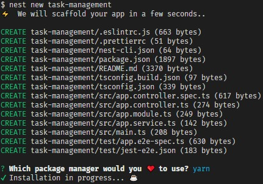

# Nest v7.4.0

A quick guide for NestJS | September 2020

0. CLI
   1. Installation:
   ```typescript
   // npm
   $ npm i -g @nestjs/cli
   // or yarn (CMD Admin: $ choco install yarn)
   $ yarn global add @nestjs/cli
   ```
   2. Create a project: `$ nest new task-management`
      NOTE: Something I love
      
   3. Main commands by Nest CLI:
      ```typescript
      // Installation
      $ npm install
      // Running the app: development
      $ npm run start
      // Running the app: watch mode
      $ npm run start:dev
      // Running the app: production mode
      $ npm run start:prod
      // Test: unit tests
      $ npm run test
      // Test: e2e tests
      $ npm run test:e2e
      // Test: test coverage
      $ npm run test:cov
      ```
